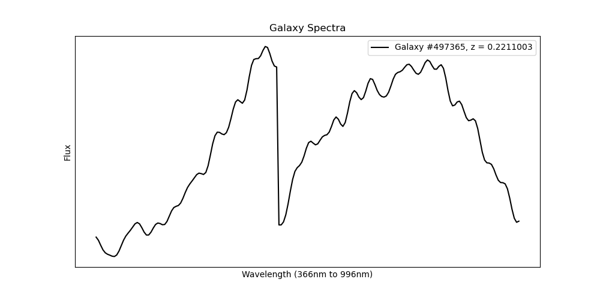
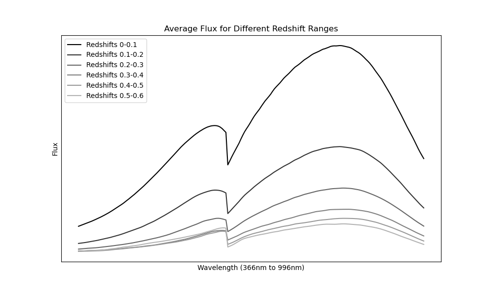

# Παρουσίαση Διπλωματικής Εργασίας

## Εφαρμογή Τεχνικών Μηχανικής Μάθησης σε Αστρονομικές Βάσεις Δεδομένων

Απόστολος-Ηρακλής Κυραλεός (ΑΜ: 711171037)
Πέμπτη 12 Οκτωβρίου 2023
Τμήμα Μηχανικών Πληροφορικής
Πανεπιστήμιο Δυτικής Αττικής

---

# Περιεχόμενα

1. Εισαγωγή
2. Επισκόπηση συνόλου δεδομένων
3. Μεθοδολογία
4. Αποτελέσματα
5. Ερωτήσεις

---

## Στόχος διπλωματικής εργασίας

- Σχεδίαση, υλοποίηση και εκπαίδευση ενός συνελικτικού νευρωνικού δικτύου
- Εφαρμογή του σε φάσματα γαλαξιών
- Πρόβλεψη της ερυθρής μετατόπισης (redshift) των γαλαξιών
- Ανάλυση αποτελεσμάτων

---

# Τεχνητά Νευρωνικά Δίκτυα (Artificial Neural Network - ANN)

---

## Νευρωνικά Δίκτυα

- Μια κατηγορία μοντέλων μηχανικής μάθησης
- Εμπνευσμένο από τη δομή του ανθρώπινου εγκεφάλου
- Αποτελείται από διασυνδεδεμένους κόμβους (νευρώνες)

---

## Στοιχεία νευρωνικού δικτύου

1. **Επίπεδο εισόδου**: Λαμβάνει δεδομένα
2. **Κρυφά επίπεδα**: Επεξεργάζεται και μαθάινει από δεδομένα
3. **Επίπεδο εξόδου**: Παρέχει προβλέψεις ή ταξινομήσεις

---

## Τρόπος Λειτουργίας

- Οι πληροφορίες ρέουν μέσω διασυνδεδεμένων νευρώνων
- Οι νευρώνες εφαρμόζουν μαθηματικές πράξεις στην είσοδο
- Η μάθηση πραγματοποιείται μέσω αλγορίθμων βελτιστοποίησης

## Εκπαίδευση νευρωνικού δικτύου

1. Εισαγωγή δεδομένων με γνωστές εξόδους
2. Συνάρτηση απώλειας μετρά τη διαφορά μεταξύ προβλέψεων και πραγματικών εξόδων
3. Προσάρμοση βαρών των νευρώνων για ελαχιστοποίηση απώλειας

---

# Συνελικτικά νευρωνικά δίκτυα (Convolutional Neural Network - CNN)

---

## Συνελικτικά νευρωνικά δίκτυα

- Εξειδικευμένα για προβλήματα με δεδομένα εικόνας και βίντεο
- Εμπνευσμένα από το ανθρώπινο οπτικό σύστημα
- Εξαιρετικα στην αποτύπωση οπτικών χαρακτηριστικών

## Βασικά στοιχεία των CNN

1. **Συνελικτικά επίπεδα**: Εντοπισμός τοπικών χαρακτηριστικών
2. **Επίπεδα pooling**: Downsampling και χαμήλωση διαστάσεων
3. **Πλήρως συνδεδεμένα επίπεδα**: Κάνουν την τελική πρόβλεψη και βρίσκουν χαρακτηριστικά υψηλού επιπέδου

---

## Συνελικτικά επίπεδα

- Νευρώνες που συνδέονται με τοπικές περιοχές δεδομένων εισόδου (receptive field)
- Μοιράζονται βάρη μεταξύ των νευρώνων
- Ισχυρά για αναγνώριση μοτίβων εικόνων

## Επίπεδα Pooling

- Μειώνουν τις διαστάσεις
- Διατηρόντας τα σημαντικά χαρακτηριστικά
- Αποτρέπουν την υπερεκπαίδευση (overfitting)

---

## Πλήρως συνδεδεμένα επίπεδα

- Συνδέουν όλους τους νευρώνες από προηγούμενα στρώματα
- Δημιουργούν τελικές προβλέψεις ή ταξινομήσεις
- Βρίσκουν χαρακτηριστικά υψηλού επιπέδου

---

# Αποστολή Gaia της ESA & Redshift Γαλαξιών

---

## Αποστολή Gaia της Ευρωπαϊκής Διαστημικής Υπηρεσίας

- Ξεκίνησε το 2013
- Στοχεύει στη δημιουργία ενός ακριβούς τρισδιάστατου χάρτη του γαλαξία μας
- Μετρά τις θέσεις, τις αποστάσεις, τις κινήσεις και τη φωτεινότητα των ουράνιων αντικειμένων
- Παρέχει ανεκτίμητα στοιχεία για διάφορες αστροφυσικές μελέτες

---

## Redshift Γαλαξιών

- Περιγράφει τη σχετική κίνηση ενός γαλαξία σε σχέση με τη Γη
- Μετριέται με ανάλυση του φάσματος του εκπεμπόμενου φωτός του γαλαξία
- Προκύπτει από το φαινόμενο Doppler, το οποίο μετατοπίζει το φως προς μεγαλύτερα μήκη κύματος
- Κρίσιμη παράμετρος στην αστρονομία για την κατανόηση της απόστασης, της ταχύτητας και της εξέλιξης των γαλαξιών

---

# Επισκόπηση συνόλου δεδομένων

---

## Πηγή και σύνθεση δεδομένων

- Προέρχονται από την αποστολή Gaia της ESA και το Sloan Digital Sky Survey (SDSS)
- Παραχωρήθηκε από τον Ιωάννη Μπέλλα-Βελίδη και την Δέσποινα Χατζηδημητρίου
- Αποτελείται από φάσματα γαλαξιών και τα αντίστοιχα redshift τους
- Το σύνολο δεδομένων περιέχει 520.393 γαλαξίες με redshifts στο εύρος $0 \le z \le 0.6$.

---

## Ανάλυση δεδομένων

- Τα redshift δεν είναι ομοιόμορφα κατανεμημένα:
  - Λοξή κανονική κατανομή
  - Μέση τιμή: $0.142$, διάμεσος: $0.126$, Std Dev: $0.079$
- **99%** των γαλαξιών έχουν $z \le 0.37$
- Επίδραση στην απόδοση του μοντέλου σε περιοχές υψηλού redshift

---

## Χαρακτηριστικά δεδομένων

- Σχήμα: Φάσμα ενός τυχαία επιλεγμένου γαλαξία
- Σχήμα: Μέσες τιμές ροής (flux) για φάσματα γαλαξιών σε διάφορα εύρη redshift

---

## Προεπεξεργασία

- Προεπεξεργασία δεδομένων απαραίτητη για την απόδοση του μοντέλου
- Κλιμάκωση χαρακτηριστικών (κλιμάκωση min-max) που εφαρμόζεται στις τιμές ροής -> $[0, 1]$
- Βελτιώνει τη σύγκλιση και τη σταθερότητα κατά την εκπαίδευση
- Ορίζεται μαθηματικά ως εξής:
  $$x_{norm} = \frac{x - x_{min}}{x_{max} - x_{min}}$$

---

# Μεθοδολογία

---

## CNNs για φάσματα γαλαξιών

- Επιλογή με βάση τα χαρακτηριστικά των δεδομένων
  - Τα φάσματα γαλαξιών είναι παρόμοια με μονοδιάστατες εικόνες
  - Τα CNN συλλαμβάνουν τοπικά μοτίβα, διατηρώντας φασματικά χαρακτηριστικά

---

## Βελτιστοποίηση υπερπαραμέτρων (hyperparameter optimization)

- Οι υπερπαράμετροι είναι προκαθορισμένες ρυθμίσεις
- Επηρεάζουν διάφορες πτυχές της διαδικασίας μάθησης
- Μέθοδοι: Αναζήτηση σε πλέγμα, τυχαία αναζήτηση, βελτιστοποίηση κατά Bayes
- Η βελτιστοποίηση κατά Bayes επιλέγεται λόγω αποτελεσματικότητας
  - Καθοδηγούμενη εξερεύνηση του χώρου υπερπαραμέτρων
  - Βέλτιστες διαμορφώσεις επιτυγχάνονται γρηγορότερα

---

## Χώρος αναζήτησης υπερπαραμέτρων

- Υπερπαράμετροι που περιλαμβάνονται στην αναζήτηση:
  - Αριθμός συνελικτικών επιπέδων
  - Αριθμός φίλτρων σε κάθε επίπεδο
  - Μέγεθος πυρήνα σε κάθε επίπεδο
  - Αριθμός πλήρων συνδεδεμένων επιπέδων
  - Αριθμός νευρώνων στα πλήρως συνδεδεμένα επίπεδα
  - Συναρτήσεις ενεργοποίησης
  - Συνάρτηση απώλειας
  - Βελτιστοποιητής
- Βελτιστοποίηση Bayesian που χρησιμοποιείται με το API της Keras

---

## Αποτελέσματα αναζήτησης υπερπαραμέτρων

- Τελική αρχιτεκτονική μοντέλου:
  - Συνελικτικά στρώματα με διάφορα μεγέθη φίλτρων
  - Πυκνά στρώματα με διαφορετικές μονάδες
  - Βελτιστοποιητής Adamax
  - Συνάρτηση απώλειας Huber
  - Batch size: 16, epochs: 20

---

## Εκπαίδευση & επικύρωση

- Εκπαίδευση σε μια GPU AMD RX 6600 (8GB VRAM)
- Χρόνος εκπαίδευσης: ~1 ώρα και 15 λεπτά
- Δεν παρατηρήθηκε υπερεκπαίδευση (overfitting)
- Οι απώλειες επικύρωσης (validation loss) ακολουθούν στενά τις απώλειες εκπαίδευσης (training loss)

---

## Μέσο απόλυτο σφάλμα (Mean Absolute Error-MAE)

- Μετρική αξιολόγησης για μοντέλα τύπου regression
- Το MAE εκπαίδευσης (training mae) συγκλίνει σε ~0.021 μετά από 20 epochs
- Το MAE επικύρωσης (validation mae) ακολουθεί την ίδια τάση

---

# Αποτελέσματα

---

## Σφάλμα & τυπική απόκλιση

- Αξιολόγηση μοντέλου στο σύνολο δοκιμών (test set ~50.000 δείγματα)
- Μέσο απόλυτο σφάλμα (MAE): 0,021 στο σύνολο δοκιμών
- Μέσο σφάλμα & τυπική απόκλιση ανά εύρος redshift

| redshift bin | mean error | std ($\sigma$) | % of data |
| ------------ | ---------- | -------------- | --------- |
| 0.00 - 0.05  | 0.0216     | 0.0236         | 6.62      |
| 0.05 - 0.10  | 0.0117     | 0.0208         | 27.77     |
| 0.10 - 0.15  | 0.0013     | 0.0243         | 28.99     |
| 0.15 - 0.20  | -0.0081    | 0.0296         | 16.61     |
| 0.20 - 0.25  | -0.0110    | 0.0346         | 8.80      |
| 0.25 - 0.30  | -0.0122    | 0.0333         | 6.00      |
| 0.30 - 0.35  | -0.0248    | 0.0351         | 3.55      |
| 0.35 - 0.40  | -0.0458    | 0.0416         | 1.15      |
| 0.40 - 0.45  | -0.0793    | 0.0593         | 0.30      |
| 0.45 - 0.50  | -0.1327    | 0.0806         | 0.11      |
| 0.50 - 0.55  | -0.1804    | 0.1128         | 0.06      |
| 0.55 - 0.60  | -0.2100    | 0.0978         | 0.04      |

---

## Μέσο σφάλμα και τυπική απόκλιση

- Το απόλυτο μέσο σφάλμα είναι $\le |0.21|$ για το σύνολο των δεδομένων
- Καθώς αυξάνεται το redshift, το μέσο σφάλμα και η τυπική απόκλιση αυξάνονται
- Το μοντέλο εκπαιδεύτηκε σε ένα σύνολο δεδομένων με κυρίως γαλαξίες χαμηλού redshift
- Μέσο απόλυτο σφάλμα για τα πρώτες 7 bins (0 έως 0,35): 0.013
- Μέση τυπική απόκλιση για τα πρώτα 7 bins: 0,032
- Bins με τις καλύτερες επιδόσεις: 2η έως 6η (88,17% των δεδομένων), Μέσο σφάλμα: 0.00886

---

## Σύγκριση με το SVM του Unresolved Galaxy Classifier - UGC

---

## Οπτική ανάλυση - Ιστόγραμμα

- Προβλέψεις του μοντέλου σε σχέση με τις πραγματικές τιμές
- Ορισμένες αποκλίσεις, αλλά συνολικά πολύ κοντά

---

## Οπτική ανάλυση - Δισδιάστατο ιστόγραμμα

- Λεπτομερής ανάλυση των προβλεπόμενων έναντι των πραγματικών redshift
- Σημεία κοντά στη διαγώνια γραμμή
- Λίγες ακραίες τιμές (outliers)
- Αρνητικό bias εμφανές στις ανώτερες περιοχές redshift

---

# Ερωτήσεις;
